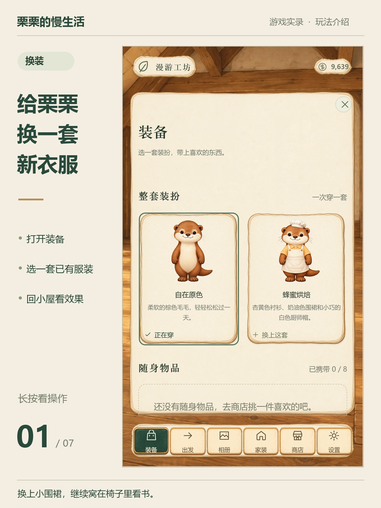
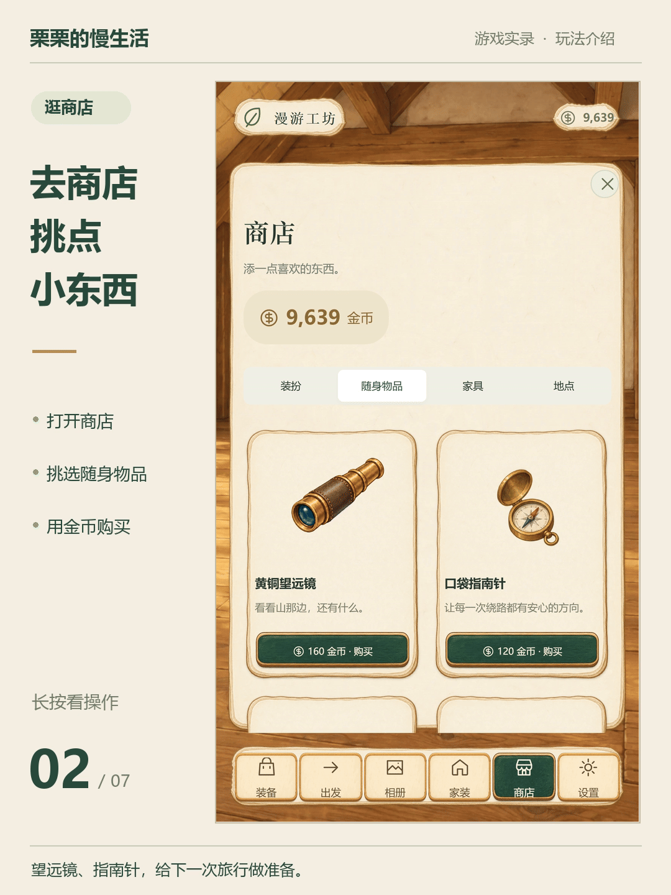
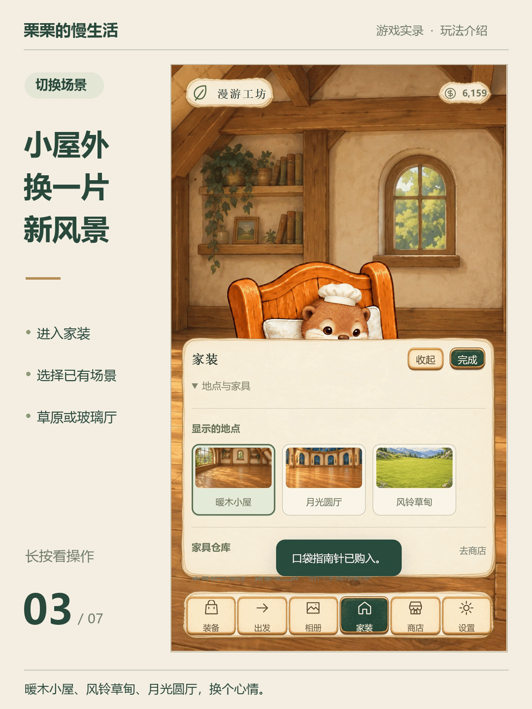
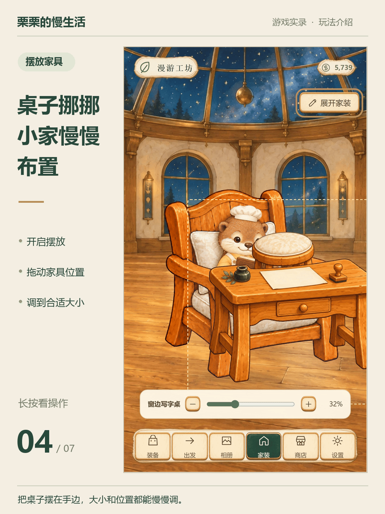
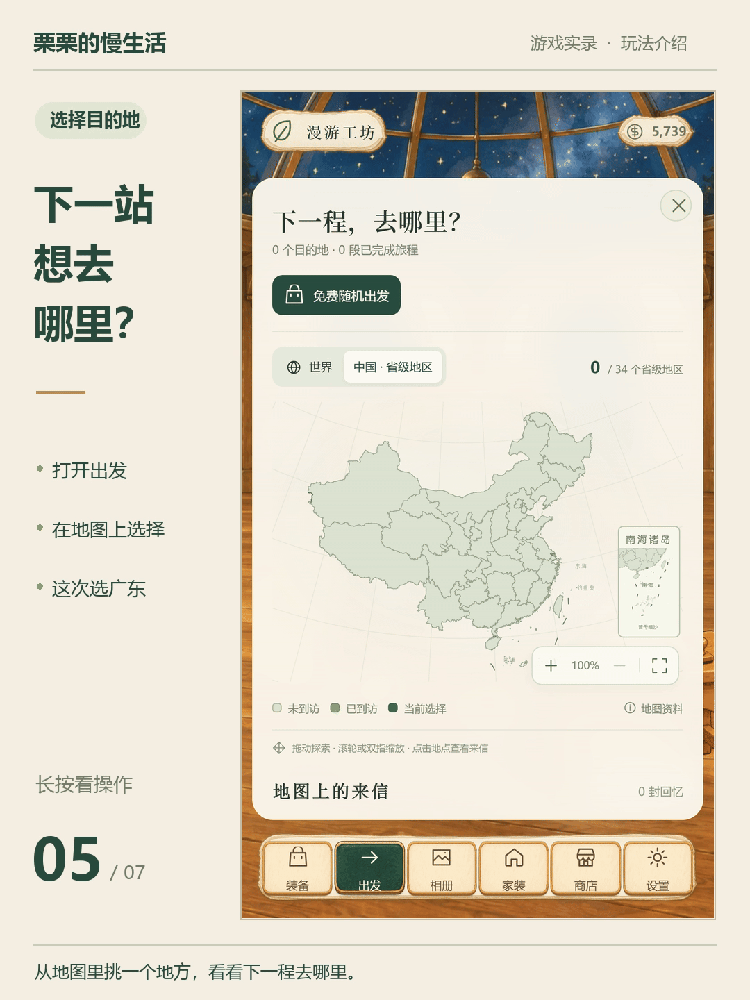
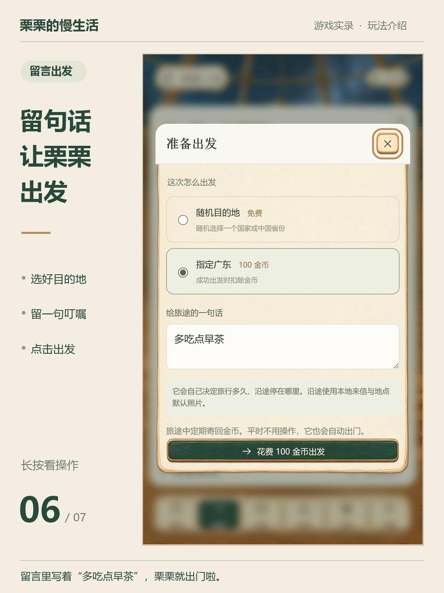

# 旅行栗栗


看到《旅行青蛙·中国之旅》的告别公告，我们挺舍不得的。还想给蛙蛙收拾行囊，等它从远方多寄几张明信片回来。🐸 谢谢原作的制作组，给我们留下了这么多温暖的回忆。

为了纪念蛙蛙，我们也做了一个小游戏，叫《旅行栗栗》。栗栗是一只我们自己创作的小水獭，没沿用蛙蛙的形象。你可以给它布置小屋，准备好行囊，再等它把路上的照片和来信寄回来。

《旅行栗栗》会把代码完整开源，可以在自己的电脑上玩，也有直接打开就能玩的试玩链接。

我们也很在意游戏里攒下来的回忆能不能留下。栗栗的照片和存档都能导入、导出，大家可以留一份在自己手里。哪天暂时不想玩了，就先好好收着。

如果你愿意，欢迎来认识栗栗。

小青蛙，谢谢你的陪伴。出门记得吃饱一点。

**[点这里，直接试玩《旅行栗栗》](https://roam-atelier-q90-trial.yukipeng256.chatgpt.site/)**

不用安装，也不用配置 Key。试玩版已经准备好了 **228 个目的地的明信片图库**，栗栗会在旅行途中把各地的风景寄给你，慢慢收进你的相册。

[在自己电脑上玩](#快速启动) · [开发文档](#开发与自定义) · [反馈问题](https://github.com/Chaotic-Pendulum/roam-atelier-q90/issues)

[](https://github.com/Chaotic-Pendulum/roam-atelier-q90/actions/workflows/ci.yml) · [代码许可：MIT](LICENSE)

## 演示视频

https://github.com/user-attachments/assets/3dfdde4a-86aa-4310-ab29-ed92073e150a

## 快速启动

需要 **Node.js 20.12 或更新版本**。

```bash
git clone https://github.com/Chaotic-Pendulum/roam-atelier-q90.git
cd roam-atelier-q90
npm start
```

打开终端打印的网址，默认是 **http://127.0.0.1:4173/**。

无需执行 `npm install`，无需构建，也不用配置模型。

不使用 Git 的话，也可以点击仓库的 **Code → Download ZIP**，解压后进入含 `package.json` 的文件夹，再运行 `npm start`。

Windows PowerShell 如果提示禁止运行 `npm.ps1`，使用：

```powershell
npm.cmd start
```

或直接运行 `node server/dev.mjs`。不要双击 `dist/index.html`；游戏需要通过 HTTP(S) 服务读取资源。


## 可以怎么玩

### 给栗栗换装

给栗栗挑一套喜欢的衣服，再去商店选些随身物品，装进行囊里。

<p>
  
</p>
<p>
  
</p>

### 布置自己的小屋

换个喜欢的生活场景，再把家具慢慢摆好。位置、大小、水平翻转和前后遮挡，都可以自己调整。

<p>
  
</p>
<p>
  
</p>

### 等一封旅行来信

收拾好行囊，就让栗栗出门吧。随机出发免费，也可以花游戏金币指定一个想去的地方。临行前留句话，等它把路上的照片和金币寄回来。

<p>
  
</p>
<p>
  
</p>

旅行需要一些时间，支持自定义修改时长，并从下一程开始生效。

### 收集回忆

回来时翻翻相册，看看栗栗又去了哪里。也可以导入自己的旧照片，给它们写个标题，留几句备注。


### 制作自己的版本

**下载源码后，你可以用 AI 制作自己的小青蛙形象，替换角色配置和对应的互动素材，做一份属于自己的游戏。**

角色图、日常动作和默认明信片需要分别准备，素材可以自己制作，也可以用 AI 生成。具体做法见 [素材制作指南](docs/AI-ASSET-AUTHORING.md) 和 [素材包规范](docs/ASSET-PACK-SPEC.md)。

## 旅行来信如何生成

**不用配置 API，也能收到明信片。** 游戏里已经准备好覆盖 228 个目的地的旅行图库，栗栗会按旅行目的地寄回对应的图片，文案由本地规则提供。

下面这几张，就来自内置图库。

北京与上海

<p>
  
  
</p>

海南与西藏

<p>
  
  
</p>

**配好文字和图片 API 后，也可以生成新的旅行来信。** 文案和照片会结合目的地、栗栗的装扮、随身物品和所选风格生成。请在出发前保存配置，新出发的旅程就会使用它。

内置明信片每个目的地一张，穿搭和动作已预先绘制；同一目的地的多封来信可能使用同一张图片。仅配置图片 API 时，可以基于本地文案生成照片；仅配置文字 API 时，当前仍使用默认图库。接口失败时会回退到本地文案和默认图片。

完整图片目录和制作记录见 [TRAVEL-PHOTOS.json](dist/packs/reading-room/TRAVEL-PHOTOS.json)。

## 示例素材

| 内容 | 数量 |
| --- | ---: |
| 生活场景 | 20 个 |
| 完整装扮 | 10 套 |
| 家具 | 10 种 |
| 互动动作 | 200 组、400 张动作帧 |
| 随身物品 | 100 件，最多携带 8 件 |
| 旅行照片风格预览 | 20 种 |
| 目的地专属旅行插画 | 228 张 |

运行素材采用 Q90 WebP，保留原尺寸与透明通道。家具、人物与互动帧通过配置关联，不需要运行时骨骼绑定或逐件服饰叠图。

## 可选：连接 AI

<details>
<summary>支持的协议、配置步骤与调用规则</summary>

在「设置 → 开发者设置」中分别填写文字和图片接口的 **协议、Base URL、模型名、API Key**。保存设置不会自动发起模型测试。

| 接口 | 支持的协议 |
| --- | --- |
| 文字 | Responses / Chat Completions 兼容接口 |
| 图片 | Images Generations / Edits，以及 OpenRouter Images JSON |

具体模型名称、尺寸和质量参数以供应商支持情况为准。

- 文字模型按已确定的目的地、装扮和行囊规划旅行内容；图片模型生成沿途照片。
- 配置可用的 Key 后，游戏**不设每日三次限制**，旧存档里的限制字段也会忽略。
- 每程仍按 **1–3 个来信节点**逐张生成，后续旅程可以继续生成；供应商余额和速率限制仍然适用。
- AI 请求失败时使用本地文案和默认图片，不会自动无限重试。
- 页面输入的 Key 仅保存在当前页面内存，刷新后需重新填写；不会写入存档或素材包。

使用附带 Node 服务时，可把 `.env.example` 复制为 `.env`，填写自己的配置后重启。密钥可以留在本地服务端；`.env` 已被 Git 和打包脚本排除。

纯静态部署没有附带 Node 代理，需要选择浏览器直连，且供应商必须允许 CORS。公开运行 Node 代理时，还需配置访问令牌和供应商域名白名单；参数见 `.env.example`。

</details>

## 存档与备份

进度、素材和照片通过 IndexedDB 保存在当前浏览器。不同设备、浏览器及站点地址的存档彼此独立，没有公共账号或云端自动同步。

在「设置 → 开发者设置 → 导出完整存档」中等待准备进度完成，再点击 **「保存 ZIP 文件」**。文件包含游戏进度、素材和照片，可以用「导入存档」恢复或迁移到另一台设备。

首次导出需要收集内置素材、旅行图库和个人照片，请保持页面打开。清理浏览器数据可能导致本地存档丢失，建议提前备份。

关闭页面期间不会创建新旅程或请求模型；重新打开后会结算进行中的旅程。离线可使用已经缓存的程序和素材。

## 部署试玩网站

基础玩法可以作为静态网站部署：

- 发布目录：`dist`
- 入口文件：`index.html`
- 构建命令：不需要
- 运行环境：支持 HTTPS 的静态托管服务

将 `dist/` 的内容放到站点根目录，或使用打包生成的 `roam-atelier-game-q90.zip`。不需要数据库，也不需要把 `.env` 上传到静态站点。

测试版与正式版可以使用不同站点地址来隔离存档。同一域名下仅更换路径不一定能隔离 IndexedDB。

## 开发与自定义

`dist/` 是实际源码和运行资源目录，**不是可删除的临时构建产物**。

<details>
<summary>源码目录</summary>

```text
dist/app/           界面、渲染、存储与 AI 适配
dist/app/core/      游戏规则、旅行、计时与素材校验
dist/packs/         示例素材包
dist/maps/          地图和来源说明
dist/ui/            手绘界面资源
server/             可选本地 API 代理
docs/               使用、架构和素材规范
scripts/            检查与打包
tests/              规则、交互、存档与打包回归测试
```

</details>

- [架构说明](docs/ARCHITECTURE.md)
- [素材包规范](docs/ASSET-PACK-SPEC.md)与[机器可读 Schema](docs/pack.schema.json)
- [AI 素材制作指南](docs/AI-ASSET-AUTHORING.md)
- [UI 皮肤说明](docs/UI-SKIN.md)
- [完整使用说明](docs/USER-GUIDE.md)
- [贡献指南](CONTRIBUTING.md)与[更新记录](CHANGELOG.md)

<details>
<summary>检查、打包与发行文件</summary>

检查与打包：

```bash
npm test
npm run check
npm run package
```

打包输出到 `releases/`：

| 文件 | 用途 |
| --- | --- |
| `roam-atelier-game-q90.zip` | 可部署的静态游戏 |
| `roam-atelier-source.zip` | 源码、运行素材、代理、文档与测试 |
| `reading-room.roampack.zip` | 可通过素材管理导入的示例包 |
| `Q90-RELEASE-MANIFEST.json` | 文件体积和 SHA-256 |

本仓库不包含完整 PNG 制作原稿。素材制作脚本中的历史 `output/` 路径不是启动依赖。

</details>

## 当前范围与反馈

这是开源预览版。基础玩法已做自动测试和 Windows 浏览器实际操作验证；真实模型供应商、iOS Safari、微信内置浏览器和弱网环境仍需分别联调。

遇到问题，请在 [Issues](https://github.com/Chaotic-Pendulum/roam-atelier-q90/issues) 提供设备、浏览器、复现步骤、预期和实际结果。请勿上传 Key、`.env` 或含私人照片的存档。

## 许可

框架代码采用 [MIT License](LICENSE)。

示例美术的授权范围见 [素材包许可](dist/packs/reading-room/LICENSE.txt)，随项目分发的工具保留各自许可。

地图是独立的第三方资料，不包含在代码和示例美术的 MIT 授权内。来源、授权与原项目的公开使用说明见 [地图资料说明](dist/maps/MAP-ASSETS.md)。原标准地图的审图号不代表派生交互地图已通过审核。
